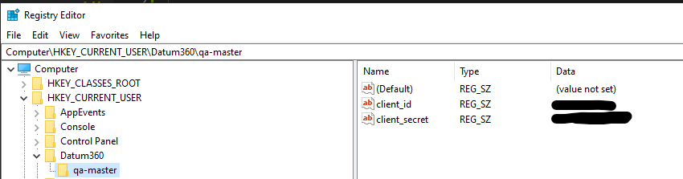

 

 # PowerShell Examples

 ## Requirements
 The examples have been written using PowerShell version 7 and greater, it is recommended to use this version.

 ## Process Excel File
 This demo shows how to:

 * Authenticate with CLS360 and PIM360
 * Retrieve EICs from PIM360
 * Create deliverables in PIM360
 * Retrieve Classes from CLS360
 * Read data from Liveviews
 * Submit Wide Import activities
 * Submit Tag-Doc Association activities
 * Submit Export activities
 * Check activities for completion

 ### Process Excel File Setup
 To run the excel demo the `process-excel-file\variables.ps1` file will need to be updated to include the username and password of a Datum360 CDP account. Update `Project_id` to be the name of the system being targeted. `cls360_Domain` should be updated to be the name of the Class Library that you are using. `eic_Tag` should be updated to be the number of the EIC used to upload data into.

 An ETL source will need to be created in CLS360 called `Mechanical Equipment List` this should map the headers in the file `examples-powershell/Files/Example_Dataset.xlsx` to attributes in your Class Library

 The Datum360 account used to run the script should have read only capabilities for CLS360 and read/write capabilities for PIM360 including the ability to create Dataset References.

 Update the file `examples-powershell/Files/Associations.txt` to replace the values for "Tag Asset" and "Doc Asset" with a facility from your class library. Update same file to replace the document numbers with document numbers from your PIM360 on the target EIC.

 ## Setup
 In these examples the credentials are stored and read from the registry, this is done to emiliminate the need for configuration files or having the credentials in the script. The registry entries should be saved like the example below.

  